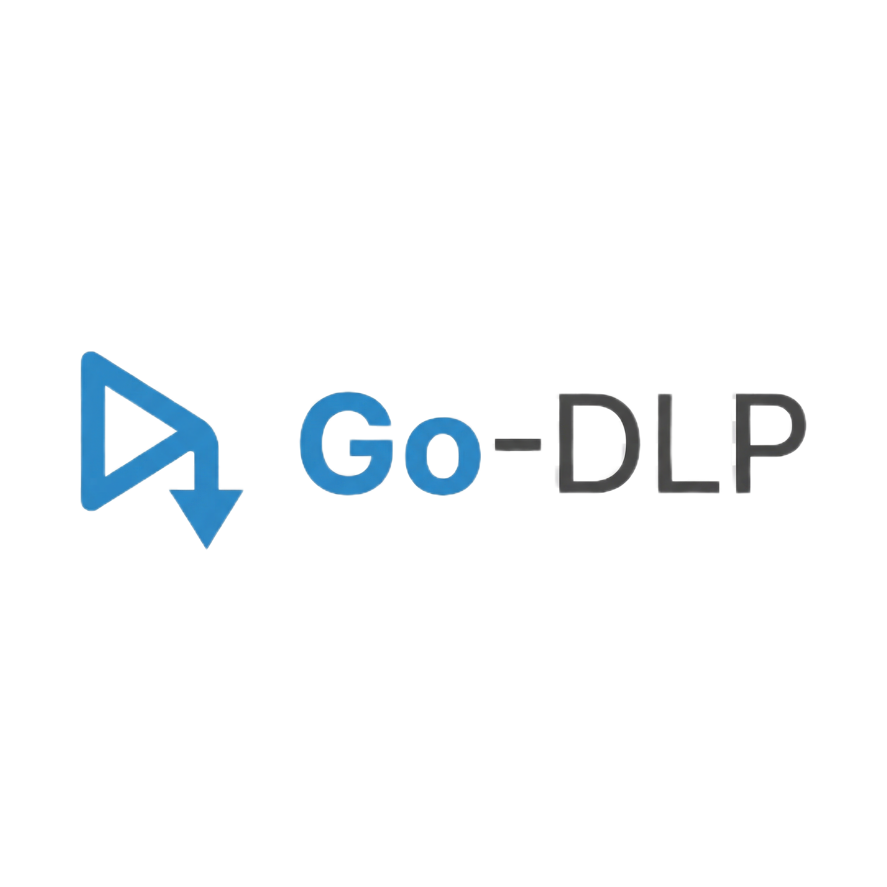

<div align="center">
  

  # Go-DLP

  [](LICENSE)
  [](go.mod)
  [](https://github.com/Locon213/Go-DLP/stargazers)
  [](https://github.com/Locon213/Go-DLP/releases)

  **현대적인 yt-dlp 데스크톱 클라이언트**

  YouTube, Vimeo, TikTok, Instagram, Twitter, SoundCloud 및 1000개 이상의 다른 플랫폼에서 동영상을 다운로드하기 위한 강력한 크로스 플랫폼 데스크톱 애플리케이션입니다.

  [🌐 웹사이트](https://github.com/Locon213/Go-DLP) • [📖 문서](#문서) • [🐛 이슈](https://github.com/Locon213/Go-DLP/issues) • [❤️ 후원](#후원)

</div>

---

## 🌍 언어 선택 | Language Selection | 选择语言

<div align="center">

| 🇺🇸 English | 🇷🇺 Русский | 🇨🇳 中文 | 🇪🇸 Español | 🇫🇷 Français |
|:---:|:---:|:---:|:---:|:---:|
| [README.md](README.md) | [README_RU.md](README_RU.md) | [README_ZH.md](README_ZH.md) | [README_ES.md](README_ES.md) | [README_FR.md](README_FR.md) |

| 🇩🇪 Deutsch | 🇵🇹 Português | 🇯🇵 日本語 | 🇰🇷 한국어 | 🇸🇦 العربية |
|:---:|:---:|:---:|:---:|:---:|
| [README_DE.md](README_DE.md) | [README_PT.md](README_PT.md) | [README_JA.md](README_JA.md) | **README_KO.md** | [README_AR.md](README_AR.md) |

</div>

---

## 🌟 기능

- ⚡ **번개처럼 빠름**: 속도와 효율성을 위해 최적화됨
- 🔐 **안전하고 프라이빗**: 외부 서버 없음
- 🎥 **고품질**: 원본 품질 유지
- 🌍 **다국어 지원**: 10개 언어 지원
- 💻 **크로스 플랫폼**: Windows, macOS, Linux에서 작동
- 🎨 **현대적 UI**: 아름답고 직관적인 인터페이스
- 📁 **형식 선택**: 다양한 동영상/오디오 형식中选择
- 🔄 **내장 변환기**: 동영상을 다른 형식으로 변환
- 🛡️ **프록시 지원**: 제한된 네트워크를 위한 프록시 설정
- 🍪 **쿠키 지원**: 브라우저에서 쿠키 추출 또는 사용자 정의 쿠키 파일 사용

## 📋 요구 사항

- Windows 7 이상, macOS 10.12 이상, 또는 Linux
- [yt-dlp](https://github.com/yt-dlp/yt-dlp)가 설치되고 PATH에서 접근 가능
- 동영상을 다운로드하기 위한 인터넷 연결

## 🚀 설치

### 사전 빌드된 바이너리

1. [릴리스 페이지](https://github.com/Locon213/Go-DLP/releases)에서 최신 버전 다운로드
2. 아카이브 추출
3. 실행 파일 실행

### 소스에서 빌드

1. [Go](https://golang.org/) 설치 (버전 1.25.5 이상)
2. [Node.js](https://nodejs.org/) 설치 (프론트엔드 빌드용)
3. 리포지토리 클론:
   ```bash
   git clone https://github.com/Locon213/Go-DLP.git
   cd Go-DLP
   ```
4. 종속성 설치:
   ```bash
   go mod tidy
   cd frontend && npm install
   ```
5. 애플리케이션 빌드:
   ```bash
   wails build
   ```
6. 애플리케이션 실행:
   컴파일된 실행 파일은 `build/bin/` 디렉터리에 있습니다:
   ```bash
   ./build/bin/go-dlp
   ```

## 📖 문서

### 기본 사용법

1. Go-DLP 애플리케이션 실행
2. 다운로드하려는 동영상의 URL 입력
3. "분석 및 다운로드"를 클릭하여 사용 가능한 형식 가져오기
4. 선호하는 형식과 품질 선택
5. 다운로드 위치 선택
6. 다운로드 완료 대기

### 고급 기능

#### 형식 선택
- 동영상에 대한 모든 사용 가능한 형식 탐색
- 해상도, 파일 크기, 품질로 필터링
- 다운로드 전에 형식 세부 정보 미리보기

#### 내장 변환기
- 다운로드한 동영상을 다른 형식으로 변환
- 일반적인 동영상 및 오디오 형식 지원
- 배치 변환 기능

#### 프록시 구성
- 시스템 프록시 설정 구성
- 수동 프록시 구성 설정
- 특정 도메인에 대해 프록시 우회

#### 쿠키 지원
- 브라우저에서 쿠키 추출
- 사용자 정의 쿠키 파일 가져오기
- 연령 제한 콘텐츠 처리

## 🤝 기여

모든 분의 기여를 환영합니다! 도움 방법:

1. 리포지토리 포크
2. 기능 브랜치 생성 (`git checkout -b feature/amazing-feature`)
3. 변경 사항 커밋 (`git commit -m 'Add amazing feature'`)
4. 브랜치에 푸시 (`git push origin feature/amazing-feature'`)
5. Pull Request 열기

### 번역 가이드

번역 기여:

1. `frontend/src/i18n/translations.ts`에서 번역 파일 찾기
2. 기존 구조에 따라 번역 추가
3. `supportedLanguages` 배열을 해당 언어로 업데이트
4. 변경 사항과 함께 pull request 제출

## 📄 라이선스

이 프로젝트는 GNU General Public License v3.0 (GPLv3) 하에 라이선스됩니다 - [LICENSE](LICENSE) 파일을 참조하세요.

### GPL v3 주요 사항:

- 소프트웨어를 자유롭게 실행, 학습, 공유 및 수정할 수 있습니다
- 수정된 버전을 동일한 라이선스 하에 배포할 수 있습니다
- 수정의 소스 코드를 공개해야 합니다
- 수정을 동일한 조건 하에 라이선스해야 합니다
- 소프트웨어는 보증 없이 제공됩니다

## 🙏 감사

- [yt-dlp](https://github.com/yt-dlp/yt-dlp) - Go-DLP의 핵심 기술
- [Wails](https://wails.io/) - Go 및 웹 기술로 데스크톱 애플리케이션을 구축하기 위한 프레임워크
- [yt-dlp 커뮤니티](https://github.com/yt-dlp/yt-dlp) - 기본 다운로드 엔진 유지
- Go-DLP 번역 및 개선에 도움을 준 모든 기여자

## ❤️ 후원

Go-DLP가 유용하다고 생각되시면 프로젝트 지원을 고려해 주세요:

- Bitcoin (BTC): `bc1qgwur4cgs3hpzl7quc4p0yrvjw50326sxkdxldv`
- Ethereum (ERC20): `0x9aa8eB123f24B917a0955C37DeBCb2Ee7281e51d`
- TON (TON): `UQDh1PIoVthF_SRFd6x2sRNkcYRDCJ_cbi7SkAqxDBN7AAMV`
- Tether (USDT,TRC20): `TCoeX2c5L2yyeiEZ3oK2nnjpgmSxgnr9N2`

## 🐛 문제 신고

문제가 발생하면 [이슈 열기](https://github.com/Locon213/Go-DLP/issues):

- 문제에 대한 상세한 설명
- 재현 단계
- 예상 동작
- 실제 동작
- 해당하는 경우 스크린샷
- 운영 체제 및 Go-DLP 버전

## 🆘 지원

추가 도움말:

- 기존 [이슈](https://github.com/Locon213/Go-DLP/issues) 검색
- [토론](https://github.com/Locon213/Go-DLP/discussions)에 참여

---

<div align="center">
  <sub><a href="https://github.com/Locon213">Locon213</a> ❤️ 로 제작</sub>
</div>
